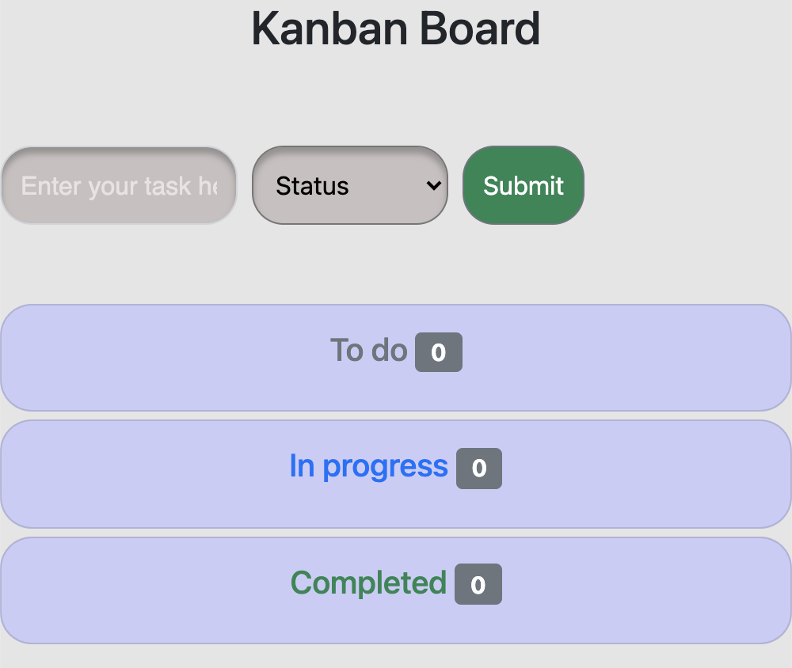
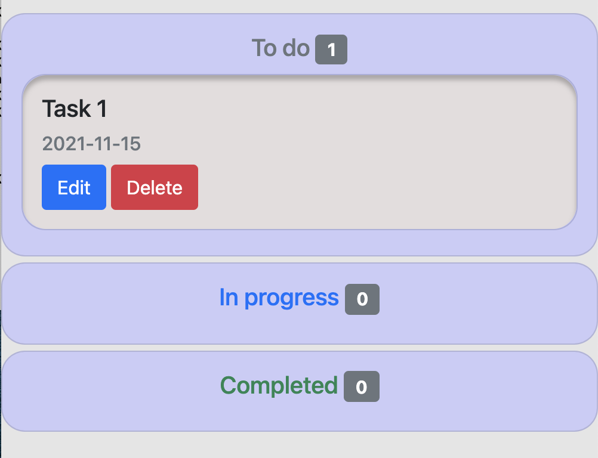

# Kanban
Project to create a kanban using Python flask

# Third party packages
```python
Before running application, first find requirements.txt in repo and  download third party packages by:
pip install -r requirements.txt
or
pip3 install -r requirements.txt
```

# How to run the app
```bash
Git clone the project
Open your terminal
Set the path: export FLASK_RUN=app
Set the development path: export FLASK_ENV=development
Type the command flask run
It should run on localhost/5000
```

# If database not found error
```python
Open your terminal in the same window where app.py is
Type python3
Type: from app import db
Type: db.create_all()
Type: exit()
Type: flask run
```

# Heroku link for the app
To open the app in heroku [click here](https://bishalkanban.herokuapp.com/)

# Screenshots of app running


